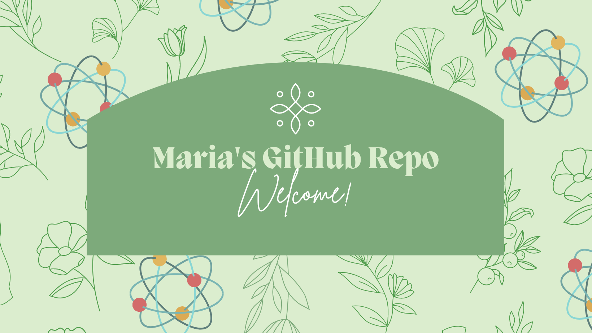

### Hi there 👋 my full name is Maria De La Luz but I go by Maria

#### 🔭 I’m currently working on becoming a Full-Stack Developer --> 💻 check out my [Portfolio](https://delaluz12.github.io/Portfolio/)

#### 🌱 I’m currently learning GraphQL & React

#### 👯 I’m looking to collaborate on anything allowing me to learn more about technology and science

#### 💬 Ask me about my plants and 100 year old farmhouse renovation 🌺🌿👩‍🌾

#### ⚡ Fun fact: I got to work with SARS-CoV-2 antibody 🔬
---------------------------

### My Stats 📊

### 📫 How to reach me:

<!--
**delaluz12/delaluz12** is a ✨ _special_ ✨ repository because its `README.md` (this file) appears on your GitHub profile.

Here are some ideas to get you started:

- 🔭 I’m currently working on ...
- 🌱 I’m currently learning ...
- 👯 I’m looking to collaborate on ...
- 🤔 I’m looking for help with ...
- 💬 Ask me about ...
- 📫 How to reach me: ...
- 😄 Pronouns: ...
- ⚡ Fun fact: ...
-->
